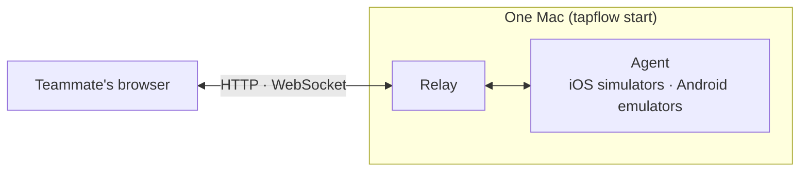
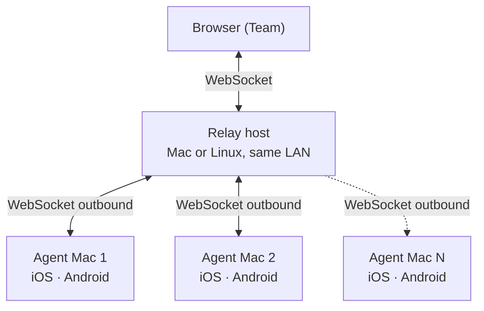

# Introduction

**tapflow** lets your entire team run mobile QA directly in the browser — no developer tools, no device management, no external cloud. After this page you will know what tapflow is made of and who does what.

<VideoPlayer src="/media/tapflow-demo.mp4" poster="/demo-thumbnail.png" />

## Why tapflow?

| Solution | Problem |
|----------|---------|
| Appetize / BrowserStack | Expensive, app data leaves your network |
| Physical devices | Cost, loss, management overhead |
| Xcode / Android Studio directly | Every team member needs their own Mac + Xcode or Android Studio setup |
| tapflow | Use infra you already own, data stays on-prem |

In short, tapflow is a self-hosted, open-source alternative to cloud testing services like Appetize and BrowserStack App Live — the same browser-based mobile QA, but builds and test data stay on infrastructure you already own.

## Operators and teammates {#who-does-what}

Two kinds of people use tapflow. One operator installs it; everyone else installs nothing.

| Who | What they do | Start here |
|---|---|---|
| Operator | Installs and runs tapflow on a Mac. Creates the admin account, uploads builds and invites the team. | [Quick Start](/get-started/quick-start) |
| Teammates (PO, PM, designers, backend engineers, QA) | Open the address the operator sent, sign in and test builds in the browser. | [For teammates](/get-started/teammates) |

## Key concepts

- **Relay** — the server between the dashboard and the agents. It serves the dashboard, stores accounts and uploaded builds, and carries the device screen and your input between the browser and an agent. A team runs one.
- **Agent** — the tapflow process on a Mac that runs iOS simulators and Android emulators and sends their screens to the relay. In these docs "agent" always means the tapflow agent; tools like Claude Code are called "coding agents".
- **Dashboard** — the tapflow screens you open in a browser. The relay serves it, so there is nothing separate to deploy.
- **App Center** — the build list inside the dashboard. It has nothing to do with Microsoft App Center. Builds are grouped by app, and an app is a bundle ID on a platform.
- **Build** — the app file you test: a simulator `.app.zip` or `.tar.gz`/`.tgz` for iOS, an `.apk` for Android.
- **QA Session** — the screen where you pick a Mac and a device for a build from App Center and drive the device from your browser.
- **Role** — what an account may do: Admin, Developer, QA or Viewer. See [Team, roles & tokens](/operate/team-and-roles).

## How it works

The simplest setup is one Mac. `tapflow start` runs the relay and an agent together on that Mac, and teammates open its address in a browser.

As the team grows, the relay runs on its own host and more agent Macs connect to it.

1. An agent connects outbound to the relay, so an agent Mac needs no inbound firewall rules.
2. Teammates open the dashboard in a browser, pick a build in App Center and start a QA Session.
3. Clicks and keystrokes reach the device in real time; the screen streams back to the browser.

::: info Streaming format by platform
- **iOS** Simulator: H.264 stream (~30 fps; JPEG fallback on older browsers)
- **Android** Emulator: H.264 stream (~30 fps)

Visual quality and latency may differ between the two. Resolution and decoder adapt to each viewer's connection — see [Streaming Quality](/operate/streaming-quality).
:::

## Two testing paths {#testing-paths}

tapflow is built for manual testing first: CI or the operator uploads a build, and teammates test it in the browser. The Get started and Test apps sections cover this path.

There is also an MCP server that lets a coding agent drive the simulator. It is a separate, experimental feature, and the manual path does not depend on it. See [MCP server](/automation/mcp-server).

## Next steps {#next-steps}

- [Quick Start](/get-started/quick-start): install tapflow on a Mac as the operator and follow it through to the first tap on your build.
- [For teammates](/get-started/teammates): start here if someone on your team sent you a tapflow address or invite link.
