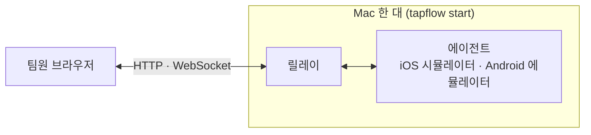
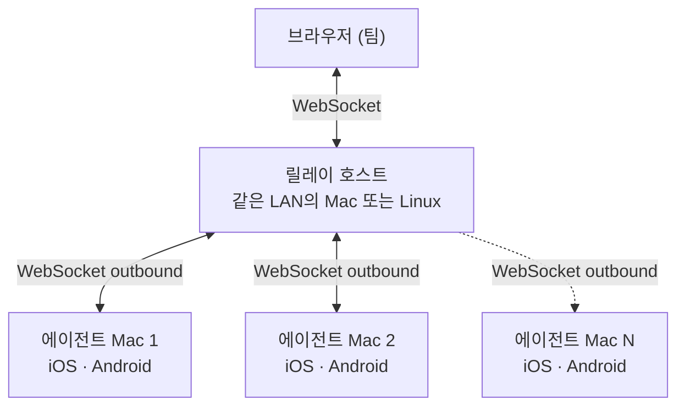

# 소개

**tapflow**를 사용하면 팀 누구나 iOS 시뮬레이터와 Android 에뮬레이터를 브라우저에서 직접 실행할 수 있습니다. 별도 도구 설치도, 기기 관리도, 외부 클라우드도 필요하지 않습니다. 이 페이지를 읽으면 tapflow를 이루는 요소와 누가 무엇을 하는지 알 수 있습니다.

<VideoPlayer src="/media/tapflow-demo.mp4" poster="/demo-thumbnail.png" />

## 왜 tapflow인가요?

| 솔루션 | 문제점 |
|--------|--------|
| Appetize / BrowserStack | 비용이 비싸고, 앱 데이터가 외부 네트워크로 유출됨 |
| 실제 기기 | 구매 비용, 분실·파손 위험, 관리 오버헤드 |
| Xcode / Android Studio 직접 사용 | 각 팀원이 Mac + Xcode 또는 Android Studio 설정 필요 |
| tapflow | 이미 보유한 인프라 활용, 데이터 온-프레미스 유지 |

요약하면, tapflow는 Appetize, BrowserStack App Live 같은 클라우드 테스트 서비스를 대체하는 오픈소스 셀프호스팅 도구입니다. 브라우저 기반 모바일 QA는 그대로 제공하되, 빌드와 테스트 데이터는 이미 보유한 인프라 안에 남습니다.

## 운영자와 팀원 {#who-does-what}

tapflow를 쓰는 사람은 두 부류입니다. 설치는 운영자 한 명이 하고 나머지 팀원은 아무것도 설치하지 않습니다.

| 누구 | 하는 일 | 시작할 페이지 |
|---|---|---|
| 운영자 | Mac에 tapflow를 설치해 실행합니다. 관리자 계정을 만들고 빌드를 올린 뒤 팀원을 초대합니다. | [빠른 시작](/ko/get-started/quick-start) |
| 팀원 (PO, PM, 디자이너, 백엔드 개발자, QA) | 운영자에게 받은 주소를 브라우저로 열고 로그인해 빌드를 테스트합니다. | [팀원 시작 가이드](/ko/get-started/teammates) |

## 핵심 개념

- **릴레이** — 대시보드와 에이전트를 잇는 서버입니다. 대시보드 화면을 제공하고 계정과 업로드된 빌드를 저장합니다. 기기 화면과 입력도 브라우저와 에이전트 사이에서 전달합니다. 팀에 하나만 실행합니다.
- **에이전트** — Mac에서 iOS 시뮬레이터와 Android 에뮬레이터를 띄우고 그 화면을 릴레이로 보내는 tapflow 프로세스입니다. 이 문서에서 "에이전트"는 늘 tapflow 에이전트를 뜻합니다. Claude Code 같은 도구는 "코딩 에이전트"라고 씁니다.
- **대시보드** — 브라우저로 여는 tapflow 화면입니다. 릴레이가 직접 제공하므로 따로 배포하지 않습니다.
- **App Center** — 대시보드 안의 빌드 목록 화면입니다. Microsoft App Center와는 관계가 없습니다. 빌드는 앱별로 모이고 앱은 bundle ID와 플랫폼으로 구분합니다.
- **빌드** — 테스트할 앱 파일입니다. iOS는 시뮬레이터용 `.app.zip` 또는 `.tar.gz`/`.tgz`, Android는 `.apk`를 올립니다.
- **QA 세션** — App Center에서 빌드를 고른 뒤 Mac과 기기를 정해 기기 화면을 브라우저에서 조작하는 화면입니다.
- **역할** — 계정마다 붙는 권한입니다. Admin, Developer, QA, Viewer 네 가지가 있습니다. 자세한 내용은 [팀·역할·토큰](/ko/operate/team-and-roles)을 참고하세요.

## 동작 원리

가장 단순한 구성은 Mac 한 대입니다. `tapflow start`를 실행하면 릴레이와 에이전트가 같은 Mac에서 함께 뜨고 팀원은 그 Mac의 주소를 브라우저로 엽니다.

팀이 커지면 릴레이를 별도 호스트에서 실행하고 에이전트 Mac을 여러 대 연결합니다.

1. 에이전트가 릴레이에 아웃바운드로 연결합니다. 에이전트 Mac에는 인바운드 방화벽 규칙이 필요 없습니다.
2. 팀원은 브라우저에서 대시보드를 열고 App Center에서 빌드를 골라 QA 세션을 시작합니다.
3. 클릭과 키 입력은 실시간으로 기기에 전달되고 기기 화면은 브라우저로 스트리밍됩니다.

::: info 플랫폼별 스트리밍 방식
- **iOS** 시뮬레이터: H.264 스트리밍 (~30fps; 구형 브라우저는 JPEG 폴백)
- **Android** 에뮬레이터: H.264 스트리밍 (~30fps)

두 방식의 화질·지연감이 다를 수 있습니다. 해상도와 디코더는 각 시청자의 연결에 따라 자동으로 조정됩니다. 자세한 내용은 [스트림 품질](/ko/operate/streaming-quality)을 참고하세요.
:::

## 두 가지 테스트 경로 {#testing-paths}

tapflow의 기본 용도는 수동 테스트입니다. CI나 운영자가 빌드를 올리면 팀원이 브라우저에서 직접 테스트합니다. 시작하기와 앱 테스트 섹션은 이 경로를 다룹니다.

코딩 에이전트가 시뮬레이터를 자동으로 조작하게 하는 MCP 서버도 있습니다. 수동 테스트와 별개인 실험적 기능이므로 쓰지 않아도 수동 테스트에는 영향이 없습니다. 자세한 내용은 [MCP 서버](/ko/automation/mcp-server)를 참고하세요.

## 다음 단계 {#next-steps}

- [빠른 시작](/ko/get-started/quick-start): 운영자라면 Mac에 tapflow를 설치하고 첫 빌드를 기기에서 탭해 보는 데까지 따라 합니다.
- [팀원 시작 가이드](/ko/get-started/teammates): 팀에서 tapflow 주소나 초대 링크를 받았다면 여기서 시작합니다.
